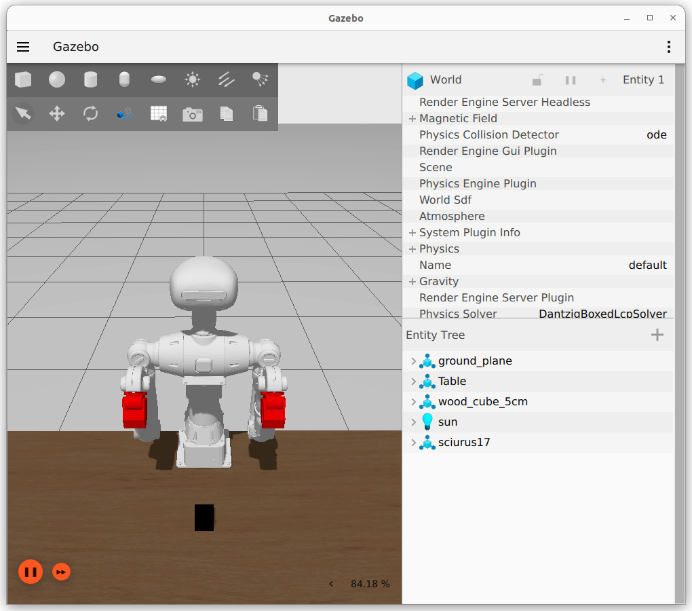

# Sciurus17_docker
　このパッケージはプライベートです。SSH key を事前に作成して使用することをおすすめします。
## インストールとセットアップ
1. **クローン**<br>
    ```bash
    git clone git@github.com:GAI-313/sciurus17_docker.git
    ```

2. **コンテナにエントリー**<br>
    ```bash
    ./entry_exec.bash
    ```
    　ビルドが成功すると自動的にコンテナにエントリーします。Nvidia GPU を搭載している PC は
    ```bash
    ./entry_exec.bash -gpu
    ```
    とオプション ```-gpu``` をつけてください。

## 起動
```bash
ros2 launch s17_bringup bringup.launch.py
```
　コンテナに入ったあとに初めて Launch を起動すると少々時間がかかります。ロボットが以下のような姿勢になっていたら成功です。



　一方以下のような姿勢になっていたら失敗です。Launch を再起動してください。


## init_pose サービス
　別のターミナルでコンテナに入り、コンテナ内で以下のコマンドを実行するとロボットが私が定義した初期姿勢に遷移します。
```bash
ros2 service call /s17_common/init_pose std_srvs/srv/SetBool "{data: true}"
```
ソースコードは
[こちら。](sciurus17_common/s17_common/src/pose_srvs.cpp)

## 終了
　コンテナから出て、ホスト内で以下のコマンドを実行
```bash
docker compose down
```

# To Do
## SpaceFinder
　作業領域内の平面部を検出するノードを作成する。

## ObstacleDetection（作成中）
　コリジョンを検出し、Moveit の動作に対応させる。ソースコードは
[こちら。](sciurus17_common/s17_vision/src/obstacle_detection.cpp)
